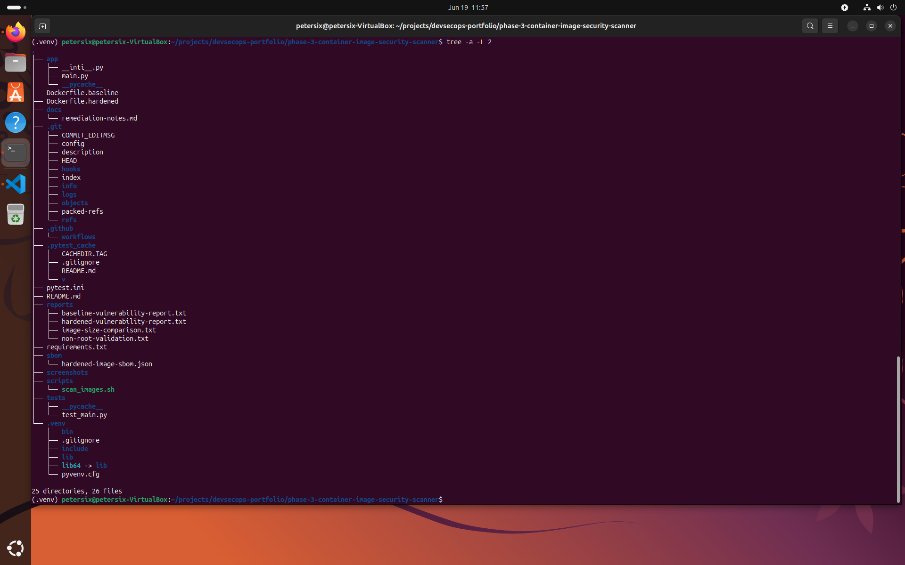
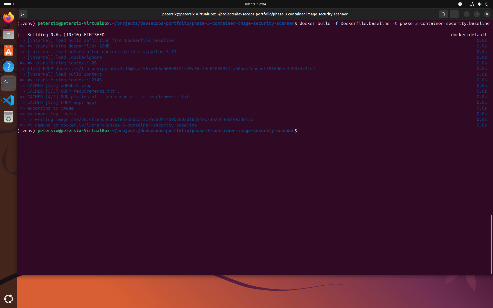
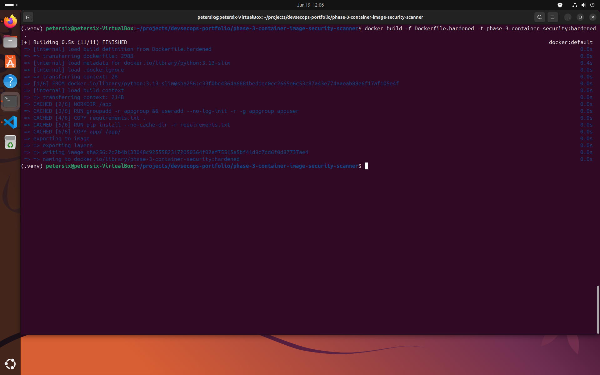
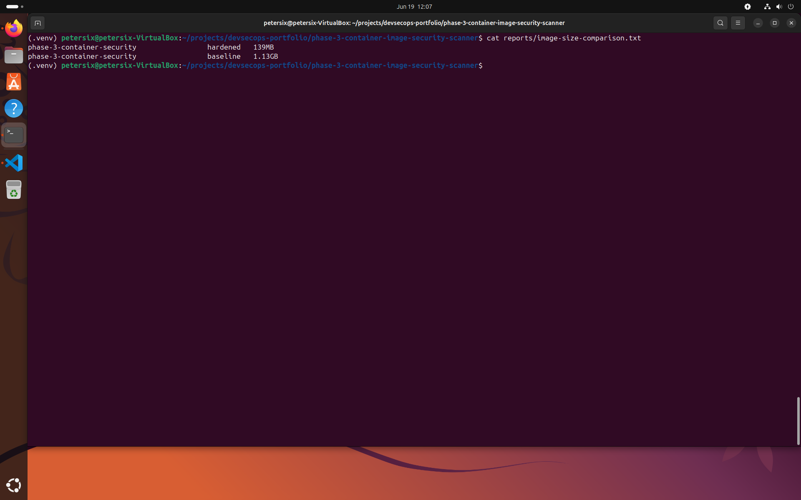
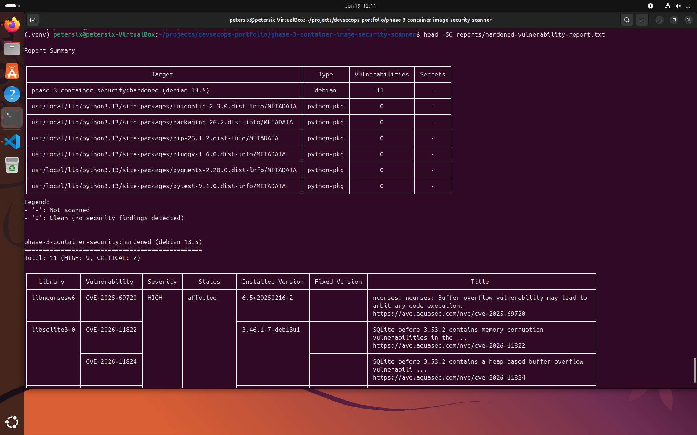
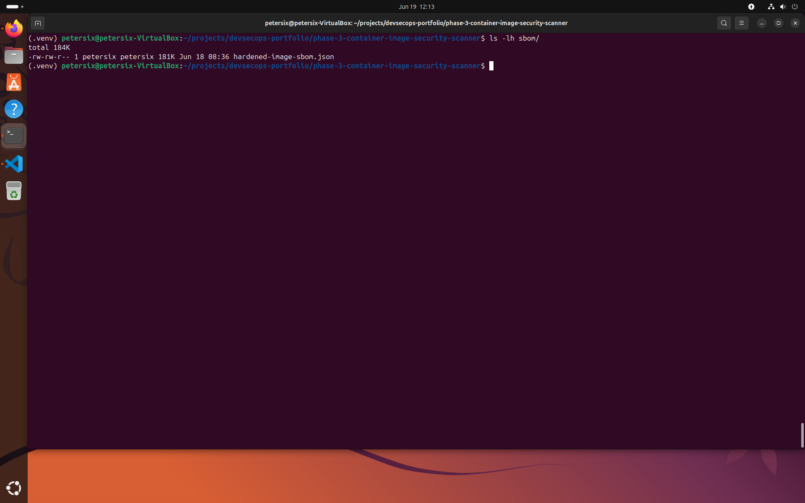
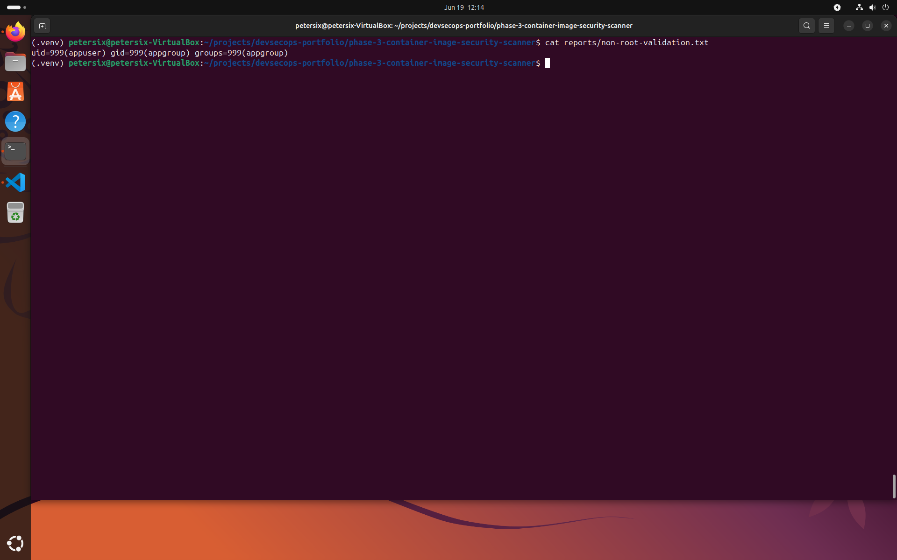
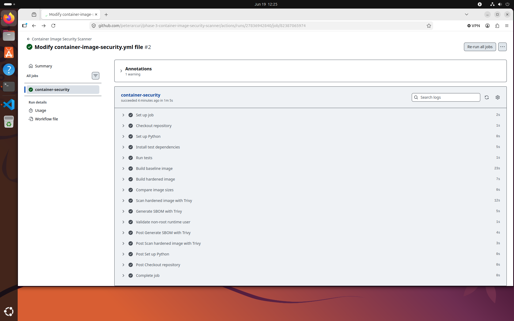

# Phase 3 — Container Image Security Scanner

A security-focused DevSecOps project designed to automate container image hardening, vulnerability scanning, Software Bill of Materials (SBOM) generation, and runtime security validation.

This project demonstrates practical container security controls commonly used in modern DevSecOps environments and CI/CD pipelines.

---

# Objectives

This project was built to strengthen hands-on experience with:

* Container image security
* Vulnerability management
* Docker image hardening
* Software Bill of Materials (SBOM) generation
* Runtime security validation
* DevSecOps CI/CD automation
* Security compliance reporting

---

# Features

## Current Features

* Docker image vulnerability scanning with Trivy
* Baseline versus hardened image comparison
* CycloneDX SBOM generation
* Automated vulnerability reporting
* Security remediation documentation
* Non-root container runtime validation
* GitHub Actions CI/CD security automation
* Automated testing with Pytest

---

## Security Controls Implemented

### Container Image Scanning

Uses Trivy to identify known vulnerabilities within Docker container images.

### Minimal Image Hardening

Compares a large baseline image against a hardened slim image to demonstrate attack surface reduction.

### SBOM Generation

Generates a CycloneDX Software Bill of Materials for dependency visibility and software supply chain security.

### Vulnerability Reporting

Produces security findings that can be reviewed and remediated during the development lifecycle.

### Runtime Security Validation

Confirms that production containers execute as a non-root user.

### CI/CD Security Automation

Automates testing, image builds, security scans, SBOM generation, and runtime validation through GitHub Actions.

---

# Tools & Technologies

* Python 3.13
* Docker
* Trivy
* GitHub Actions
* Pytest
* CycloneDX
* Ubuntu Linux
* Visual Studio Code

---

# Project Structure

```text
phase-3-container-image-security-scanner/
├── .github/
│   └── workflows/
│       └── container-image-security.yml
├── app/
│   ├── __init__.py
│   └── main.py
├── docs/
│   └── remediation-notes.md
├── reports/
├── sbom/
├── screenshots/
├── scripts/
│   └── scan_images.sh
├── tests/
│   └── test_main.py
├── Dockerfile.baseline
├── Dockerfile.hardened
├── requirements.txt
└── README.md
```

---

# Local Execution

## Run Tests

```bash
pytest
```

## Build Images and Execute Security Scans

```bash
./scripts/scan_images.sh
```

---

# Security Validation Results

## Image Size Reduction

The hardened image significantly reduces the attack surface compared to the baseline image.

Example results:

```text
Baseline Image: 1.13 GB
Hardened Image: 139 MB
```

## Non-Root Validation

The hardened container runs using a dedicated application user rather than the root account.

Example output:

```text
uid=999(appuser)
```

## SBOM Generation

A CycloneDX SBOM is generated for dependency visibility and software supply chain auditing.

## Vulnerability Scanning

Trivy scans container images for known vulnerabilities and security risks.

---

# Screenshots

## Project Structure

Shows the overall repository layout including Dockerfiles, workflows, security reports, SBOM output, source code, tests, and documentation.



---

## Baseline Docker Image Build

Demonstrates creation of the baseline container image used for comparison against the hardened image.



---

## Hardened Docker Image Build

Shows creation of the hardened container image using a minimal base image and non-root runtime configuration.



---

## Minimal Image Comparison

Demonstrates attack surface reduction by comparing image sizes between the baseline and hardened container images.



---

## Trivy Vulnerability Scan

Shows automated vulnerability scanning of the hardened container image using Trivy.



---

## SBOM Generation

Displays successful generation of a CycloneDX Software Bill of Materials for dependency visibility and supply chain security.



---

## Non-Root Container Validation

Demonstrates runtime security validation by confirming the container executes as a dedicated non-root user.



---

## GitHub Actions Security Automation

Shows the successful execution of the GitHub Actions workflow responsible for automated testing, image building, vulnerability scanning, SBOM generation, and runtime validation.



---

# Skills Demonstrated

* DevSecOps
* Container Security
* Docker Hardening
* Vulnerability Management
* Software Supply Chain Security
* SBOM Generation
* CI/CD Security Automation
* Security Compliance Validation
* Linux Administration
* Python Development
* GitHub Actions
* Security Reporting

---

# Portfolio Value

This project demonstrates practical DevSecOps skills for securing containerized workloads through image hardening, vulnerability scanning, software supply chain visibility, and automated CI/CD security validation.

The controls implemented in this project closely align with modern container security practices used in cloud-native and enterprise environments.
